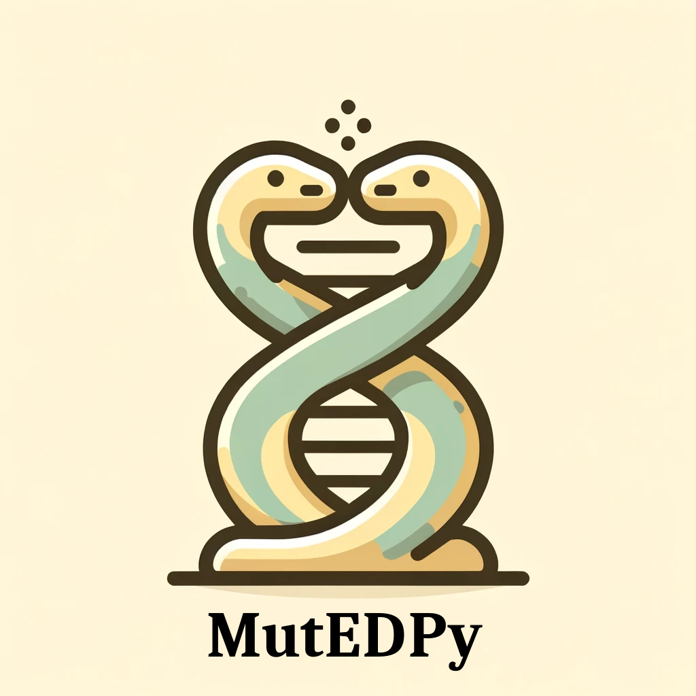

# MUTational and Embedding Data Processing Library for Python (mutedpy)

`mutedpy` is a python library that implements tools and machine learning models able to analyze mutational datasets of protein sequences and/or structures. We implement numerous shallow models targeted for datasets of sizes $10^2 - 10^6$. The models we implement:

1. Neural Networks (feed-forward, convolutional, graph)
2. linear models
3. Gaussian processes 
  - utilizing different similarirty metrics 
  - amino-acid embeddings
  - esm embeddings, data-driven embeddings
  - geometric features 

A significant part of the package is devolted to:
1. simulation of directed evolution campaigns
2. manipulation of sequence datasets:
  - conversion between different formats
  - scanning, enumeration seach 
  - data splitting train/test 

## Installation
First clone the repository:

`git clone https://github.com/Mojusko/mutedpy`

Inside the project directory, run

`pip install -e .`

The `-e` option installs the package in "editable" mode, where pip links to your local copy of the repository, instead of copying the files to the your site-packages directory. That way, a simple `git pull` will update the package.
The project requires Python 3.6, and the dependencies should be installed with the package (let me know if it doesn't work for you).

## Structure 

## Updates
- 21/05/2024 - initial commit 

## Requires
  - Classical: pytorch, cvxpy, numpy, scipy, sklearn, pymanopt, mosek, pandas
  
  - Special: 
        1. pytorch-minimize <https://github.com/rfeinman/pytorch-minimize>
        2. stpy <https://github.com/mojusko/pytorch-minimize>

## Contributions
Mojmir Mutny